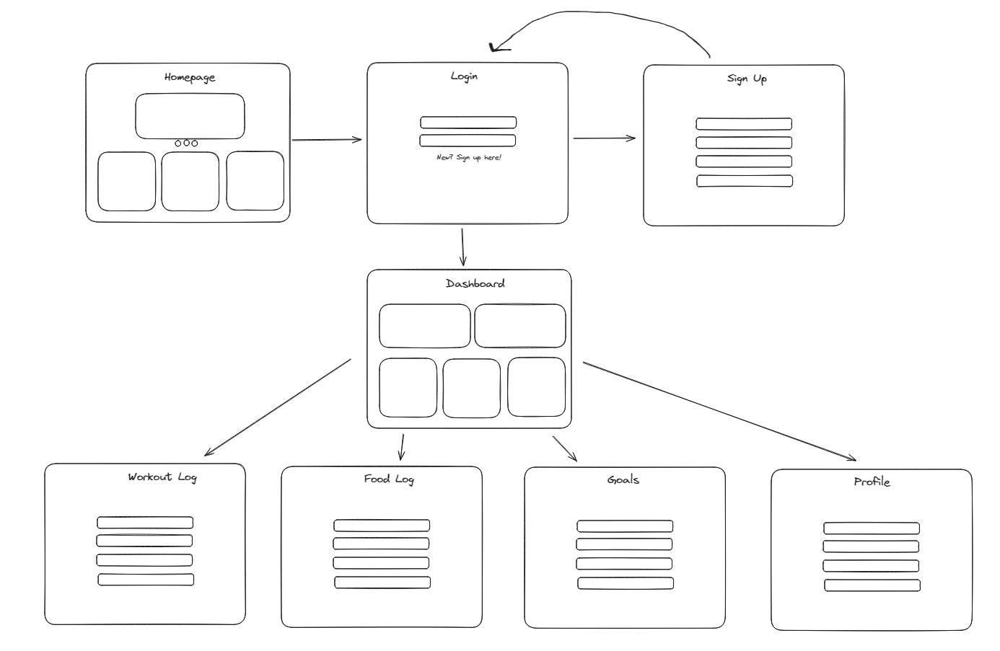

# Unnamed Workout/Food/Fitness Full Stack App

SEBPT 220 Project 2.

## User Stories

User would like to:

- Sign up and create a profile so they can use the app/site.
- Log in and out of their account so they can access their personal dashboard and keep it secure.
- Log workouts so they can keep track of their fitness activities and see progress over time.
- Edit or delete a workout entry so they can correct any mistakes or remove something.
- Log daily food intake so they can track their calorie consumption.
- View their daily, weekly, and monthly calorie intake so they can manage their diet.
- Edit or delete a food log entry so they can correct any mistakes or remove something.
- Set fitness goals.
- Track progress towards goals so they can see how close they are to achieving them.

## Wireframe

## ERD

### User

id, username, email, password, profileInfo

### Workout

id, userId, type, duration, intensity, dateOfWorkout

### Goal

id, userId, type, target, currentProgress

### FoodLog

id, userId, foodName, calories, mealType (breakfast, lunch, dinner, snack), dateConsumed